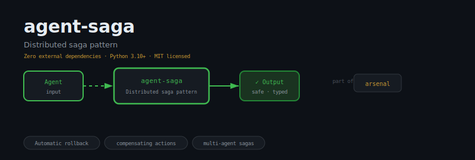
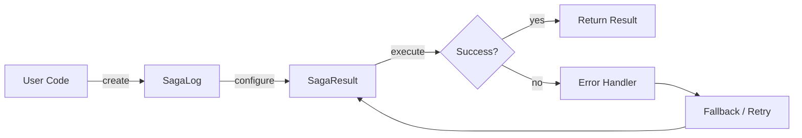
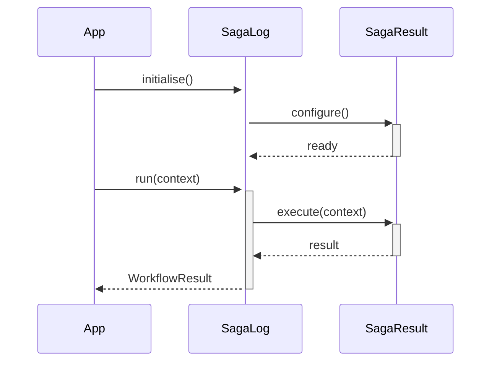

<div align="center">

</div>

# agent-saga

**Distributed saga pattern for multi-agent systems — automatic rollback without a global coordinator**

[](https://pypi.org/project/agent-saga/) [](https://python.org) [](LICENSE) [](#)

---

## The Problem

Without the saga pattern, a distributed transaction that fails halfway leaves the system in an inconsistent state. Partial writes with no compensating logic produce data corruption that is exponentially harder to clean up than to prevent.

## Installation

```bash
pip install agent-saga
```

## Quick Start

```python
from agent_saga import SagaLog, SagaResult, Saga

# Initialise
instance = SagaLog(name="my_agent")

# Use
# see API reference below
print(result)
```

## API Reference

### `SagaLog`

```python
class SagaLog:
    """Records saga lifecycle events.
    def __init__(self) -> None:
    def record(
    def events(self) -> list[dict]:
        """Return all recorded events (read-only copy)."""
    def for_saga(self, saga_name: str) -> list[dict]:
        """Return only the events that belong to *saga_name*."""
```

### `SagaResult`

```python
class SagaResult:
    """Holds the outcome of a Saga execution."""
    def to_dict(self) -> dict:
```

### `Saga`

```python
class SagaLog:
    """Records saga lifecycle events.
    def __init__(self) -> None:
    def record(
    def events(self) -> list[dict]:
        """Return all recorded events (read-only copy)."""
    def for_saga(self, saga_name: str) -> list[dict]:
        """Return only the events that belong to *saga_name*."""
```


## How It Works

### Flow



### Sequence



## Philosophy

> The *Ramayana* is itself a saga of compensating transactions — every exile balanced by a return.

---

*Part of the [arsenal](https://github.com/darshjme/arsenal) — production stack for LLM agents.*

*Built by [Darshankumar Joshi](https://github.com/darshjme), Gujarat, India.*
